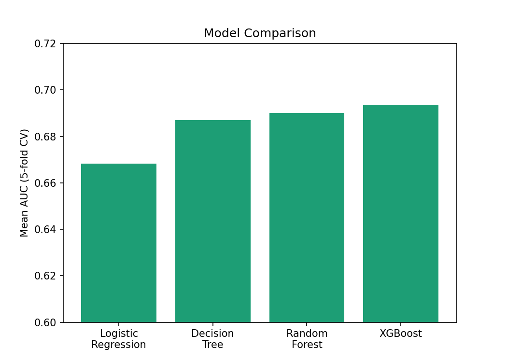
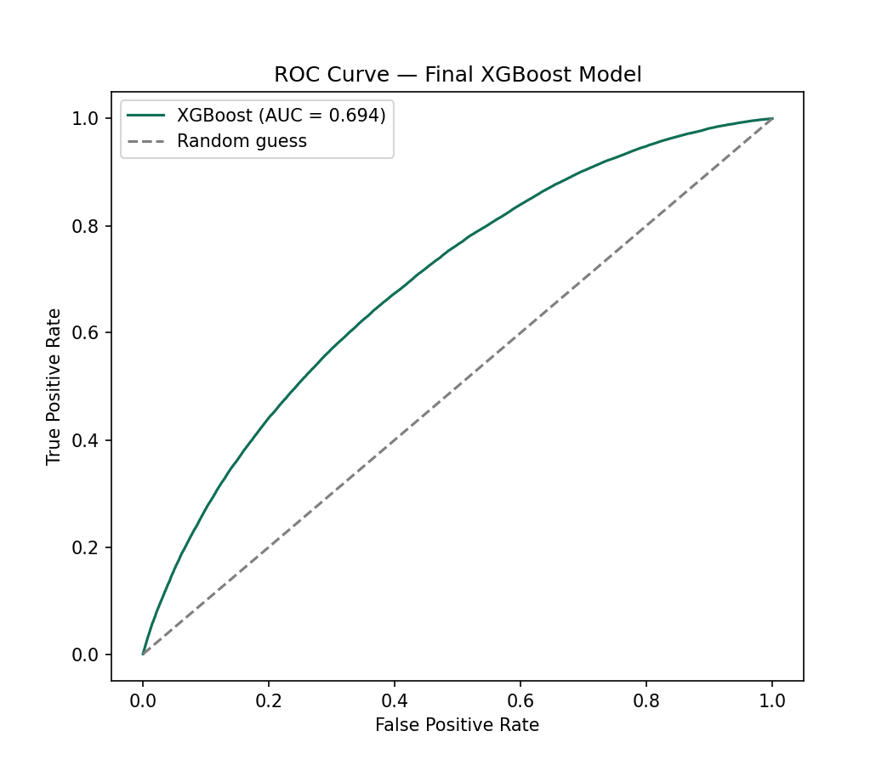

# Credit Risk Scorecard — PD, LGD & Expected Loss Estimation

An end-to-end credit risk model built on the LendingClub public consumer loan dataset — covering data cleaning, feature engineering (WOE/IV binning), model comparison, and a Basel/IRB-style points-based scorecard.

## Project overview

This project builds a Probability of Default (PD) model on 2.26M+ real consumer loans, then extends it into a full Expected Loss framework by estimating Loss Given Default (LGD) and Exposure at Default (EAD) directly from historical charge-off data. The final output is a points-based scorecard that translates model output into interpretable, underwriter-readable risk scores.

## Dataset

- **Source:** LendingClub accepted-loans dataset (public), 2007–2018
- **Raw size:** 2,260,701 rows × 151 columns
- **After cleaning:** 1,343,086 rows × 92 columns, 0 missing values

## Pipeline

| Stage | What it does |
|---|---|
| **1. Data loading** | Load the raw LendingClub CSV, confirm shape |
| **2. Data cleaning** | Filter to resolved loans (Fully Paid / Charged Off), build the binary `default` target, drop columns >40% missing, impute or drop remaining gaps |
| **3. Feature engineering** | Derive DTI and credit history length, remove sentinel/garbage values, log-transform skewed income, compute Weight of Evidence (WOE) and Information Value (IV) for each feature |
| **4. Model comparison** | Logistic Regression, Decision Tree, Random Forest, and XGBoost, each validated with 5-fold stratified cross-validation |
| **5. Evaluation & scorecard** | AUC, KS-statistic, LGD/EAD/Expected Loss calculation, and conversion to a Basel/IRB-style points-based scorecard |

## Key results

**Feature strength (Information Value):**

| Feature | IV | Strength |
|---|---|---|
| Interest rate | 0.449 | Strong |
| DTI | 0.074 | Weak but usable |
| Loan amount | 0.035 | Weak but usable |
| Log annual income | 0.029 | Weak but usable |
| Credit history length | 0.009 | Below usefulness threshold — dropped |

**Model comparison (5-fold CV, mean AUC):**

| Model | AUC |
|---|---|
| Logistic Regression | 0.668 |
| Decision Tree | 0.687 |
| Random Forest | 0.690 |
| **XGBoost** | **0.694** |




**Risk metrics on the final model:**

- **AUC:** 0.694
- **KS-statistic:** 27.5
- **Average LGD:** 90.9% (consistent with unsecured consumer lending — no collateral to recover against)
- **Portfolio Expected Loss:** 19.4% of total exposure, cross-checked against the true ~20% default rate

## Scorecard

Final features (interest rate, DTI, loan amount, log income) were WOE-transformed and converted into points using the standard industry scaling: base score 600 at 50:1 odds, 20 points to double the odds. Safer bins score positively, riskier bins negatively — giving an underwriter a fully interpretable, addable score instead of a black-box probability.

## Tech stack

Python (pandas, NumPy, scikit-learn, XGBoost), Git/GitHub

## Repository structure

```
credit-risk-scorecard/
├── data/                  # raw and cleaned data (not tracked in git)
├── figures/                # saved evaluation charts
├── models/                  # saved trained models
├── notebooks/               # analysis notebooks
├── requirements.txt
└── README.md
```

## Author

Bhushan Kindarle — MA Financial Economics, Madras School of Economics